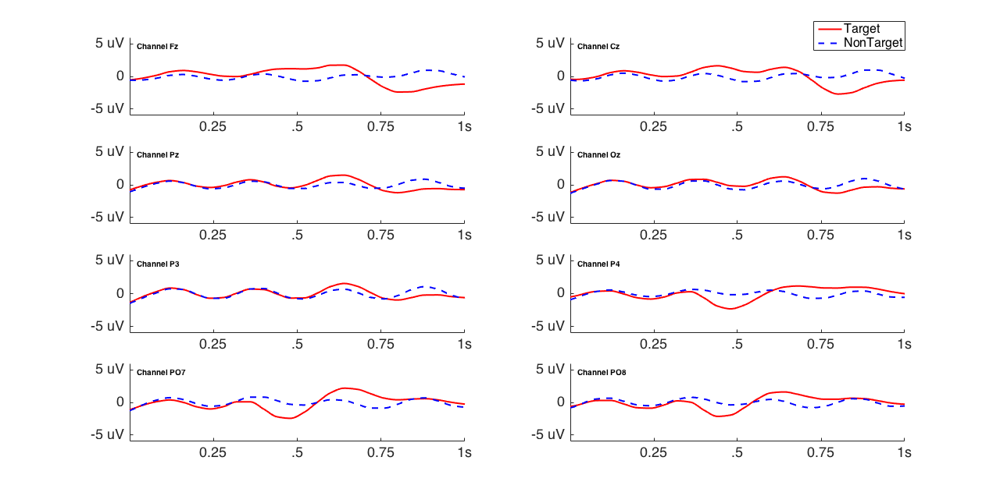
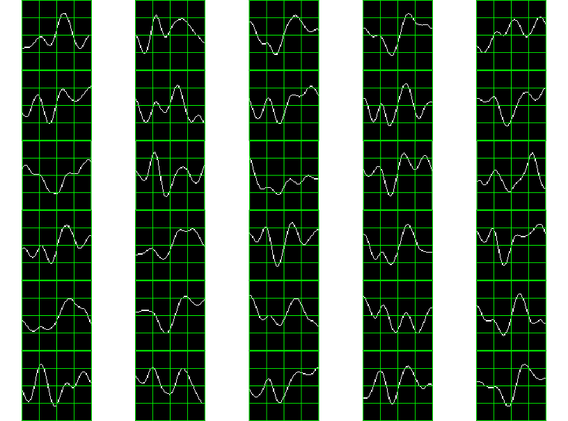

# Analisis de datos de P300 obtenidos x OpenVibe

* Dispositivo: g.Tec
* Frecuencia de muestreo: 250 Hz
* Filtro butterworth: 1-30 Hz
* Notch Filter: 50 Hz

# Experimento

El experimento se desarrollo segun los siguientes parametros:

* 7 palabras de 5 letras cada una.  Cada ''trial'' es un intento de Tx una letra.
* 120 flashes de filas y columnas de la matriz de P300. 20 corresponden a hits.
* Tiempo entre flash y flash: 0.125 ms.
* Tiempo entre trial y trial: 10 s
* Tiempo total: 1434.563 s
* Canales: 'Fz'    'Cz'    'P3'    'Pz'    'P4'    'PO7'    'PO8'    'Oz'
* Repeticiones: Cada estímulo de filas columnas se repite 10 veces.


# Procesamiento de OpenVibe

El Write Streamer genera un archivo en formato OV2. OpenVibe provee una funcion para
convertir este formato al formato de matlab '''convert_ov2mat'''.

Asi el dataset que se genera contiene las siguientes estructuras

* samples: La matriz de EEG, de 358372 x 8 canales
* sampleTime: las marcas de tiempo de 358372 x 1.
* stims: Las estimulaciones generadas en OpenVibe de 21495 x 3.  No solo contiene las estimulaciones
de filas y columnas sino que tambien tiene informacion adicional generada por OpenVibe (estado de los canales, inicio fin de cada evento, etc). Esta
estructura provee tres datos. El timestamp con la ocurrencia de la estimulacion, el ID de la estimulacion y la duracion (que aparece siempre en cero en este experimento, ya que el manejo de los inicios y fin de cada bloque se administran con ID de estimulaciones distintos).


De estos datos surge el procedimiento para procesar offline los datos:

* Identificar y separar los trials
* Determinar en samples las posiciones de inicio y fin de cada flash
* Segmentar
* Epoching (promediar p.t.p. los diferentes segmentos).
* Generar los features
* Clasificar.
* Validar

# Ajustes

En la captura del dataset, se determin? que hay un trial adicional que se col?, y que hay eliminar.
As? se limitan solamente a 4200 targets y est?mulos correspondientes (7 x 5 x 120)

# Resultados

El promedio punto a punto de los hits (700) vs nohits (3500) da



Se ve la se?al de P300 principalmente en los dos canales occipitales.

El porcentaje de letras identificadas correctamente, dividiendo el dataset entre
3 para aprendizaje y 4 para testeo (siguiendo el mismo patr?n que otros trabajos similares)
da como resultado:

```matlab
>> globalspeller

globalspeller =

  Columns 1 through 5

    0.4000    0.3000    0.2000    0.0500    0.0500

  Columns 6 through 8

    0.2000    0.5000    0.1500

```

Se verifica que el mejor canal es el PO7 alcanzando 50%, con lo que genera la siguiente frase:

```matlab
>> Word(16:end)

ans =

MANSOCINCOJUEGOQUESO

>> Speller{7}

ans =

  Columns 1 through 7

    'M'    'A'    'T'    'Y'    'O'    'H'    'I'

  Columns 8 through 14

    '6'    'O'    'O'    '2'    '1'    'E'    'L'

  Columns 15 through 20

    '7'    'Q'    'U'    'W'    'S'    'O'

```

Y utilizando Redes neuronales por ejemplo:

```matlab
>> globalspeller

globalspeller =

  Columns 1 through 4

    0.1500    0.1000    0.0500    0.0500

  Columns 5 through 8

    0.0500    0.2000    0.3500    0.0500
```


Los templates obtenidos:



# Parametros

* Gamma (image amplitude) = 4
* Escalas del descriptor: 4 x 4
* Estas cubren alrededor de 21 microVoltios y 0.84 s.
* Downsample: La Fs se baja de 250 a 25 (factor de 10).
* Filtro de Notch a 50 Hz y butterworth band-pass de 4 a 10 Hz.

# Otros métodos:

## Utilizando Feature BCI 2000 + SWLDA (mi implementación de matlab usando stewisegm)

```matlab
>> globalspeller

globalspeller =

  Columns 1 through 5

    0.5000    0.5000    0.5000    0.5000    0.5500

  Columns 6 through 8

    0.5000    0.5000    0.5500
```

## Utilizando Feature BCI 2000 + redes neuronales

Feedforward de dos capas de 128.  El feature tiene dimension 25x8=200

```matlab
>> globalspeller

globalspeller =

  Columns 1 through 5

    0.3000    0.6000    0.3500    0.5500    0.2500

  Columns 6 through 8

    0.4000    0.5000    0.7500
```

Lo cual corresponde para el canal 8 a identificar la siguiente frase

```matlab
>> Speller{8}

ans =

  Columns 1 through 7

    'M'    'A'    'N'    'G'    'R'    'C'    'I'

  Columns 8 through 14

    'O'    'C'    'R'    'J'    'U'    'E'    'G'

  Columns 15 through 20

    'U'    'Q'    'U'    'E'    'S'    'O'

```

Con SVM se obtiene la mejor clasificacion con un feature como el de BCI 2000 concatenando los 8 canales de 25 muestras cada uno (correspondientes a 1 s).

```matlab
>> globalspeller

globalspeller =

  Columns 1 through 5

    0.7500    0.8000    0.8500    0.8000    0.8000

  Columns 6 through 8

    0.7500    0.8000    0.8000

>> Speller{3}

ans =

  Columns 1 through 7

    'N'    'A'    'N'    'S'    'O'    'C'    'I'

  Columns 8 through 14

    'R'    'C'    'O'    'J'    'U'    'F'    'G'

  Columns 15 through 20

    'O'    'Q'    'U'    'E'    'S'    'O'

```

# Prueba exhaustiva de localizacion vertical y horizontal del descriptor

Iterando, para la configuración de parámetros que se pudo obtener la mejor configuración, la hipótesis es verificar si existe una localización única general específica que pueda mejorar la clasificación.

Lo que se encontró es que la mejor localización horizontal corresponde a la localización 32 (de 50).

La localizacion vertical que obtiene mejor clasificacion es precisamente la localizacion que coincide con el nivel cero de la imagen (el valor de la imagen donde se ubica el zero de la señal en ese segmento).


# Walkthrough

## Eliminación de artefactos.

La señal completa es la siguiente:
